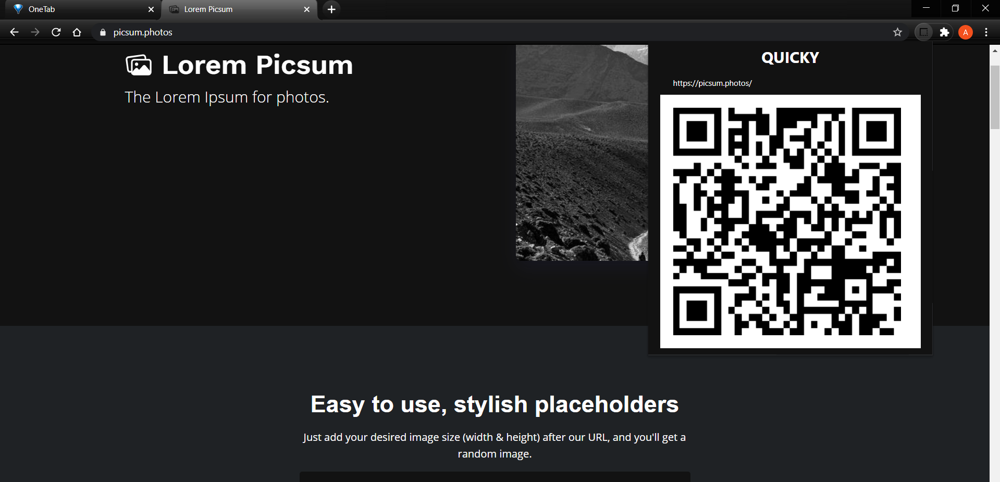

# quicky

Browser extension for quickly sharing the link of websites among devices with QRcode

- ##### `Just click the extension icon and it will automatically get the url of current page and convert into QR code.`

- ##### `Then just go and scan the QR using your google lens or anything else as per your preference.`
